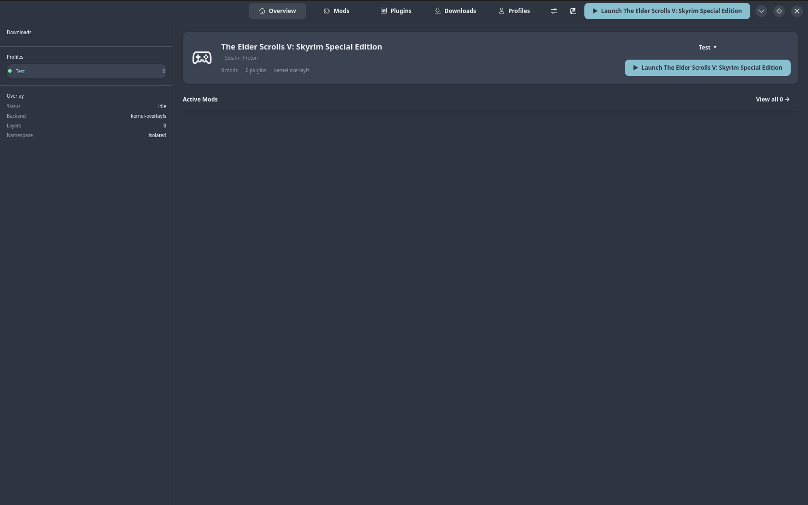
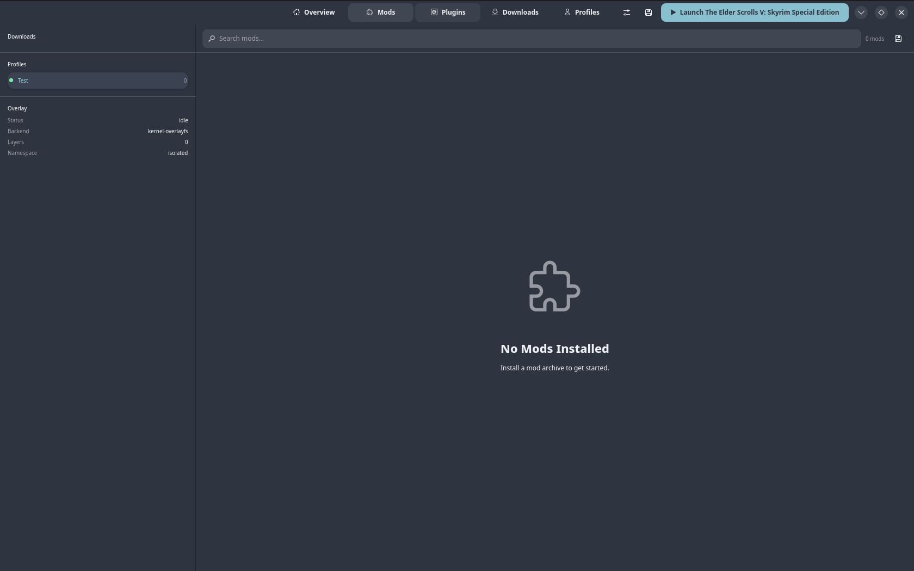
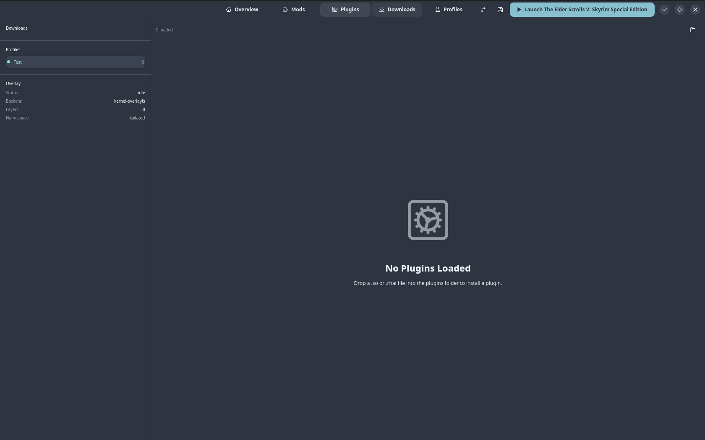
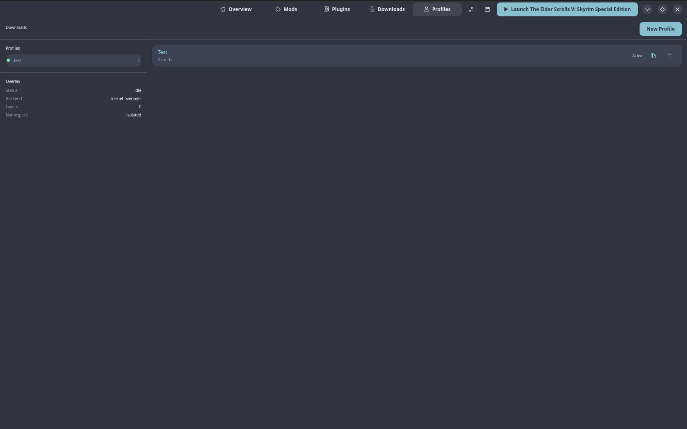
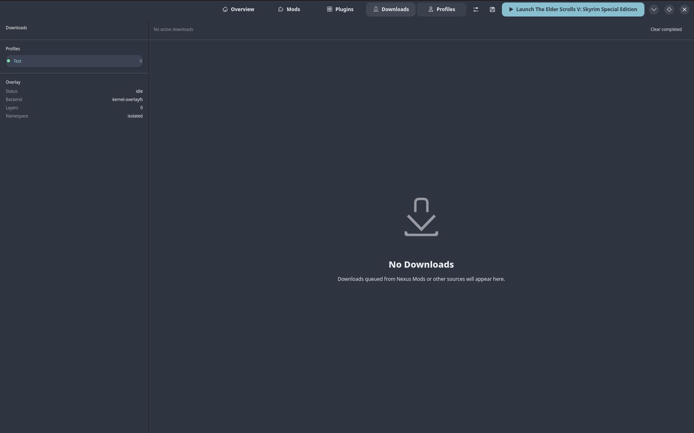
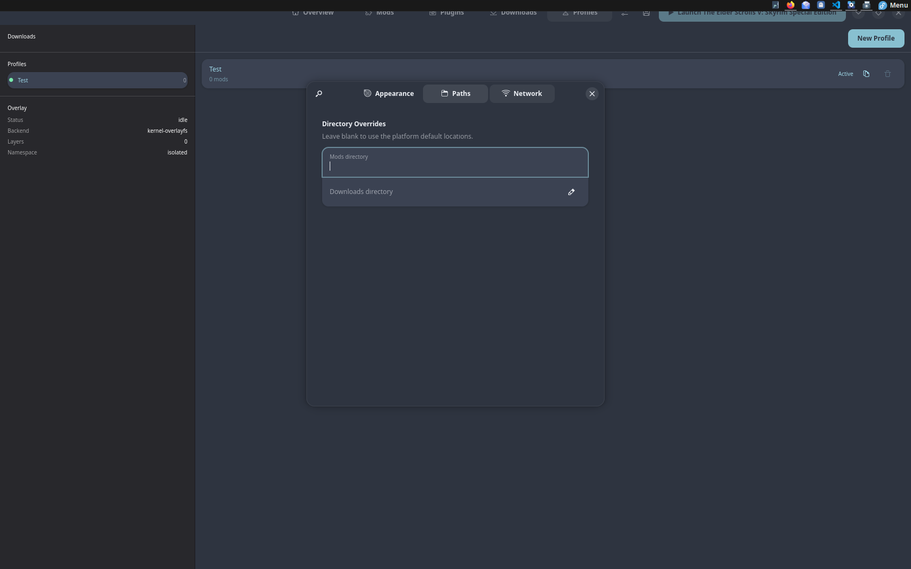
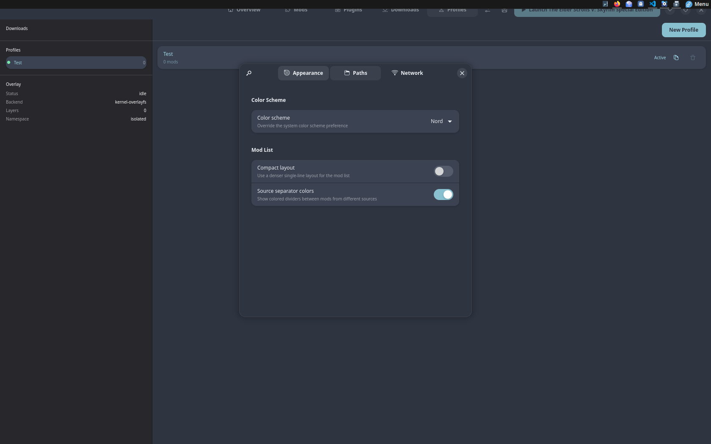
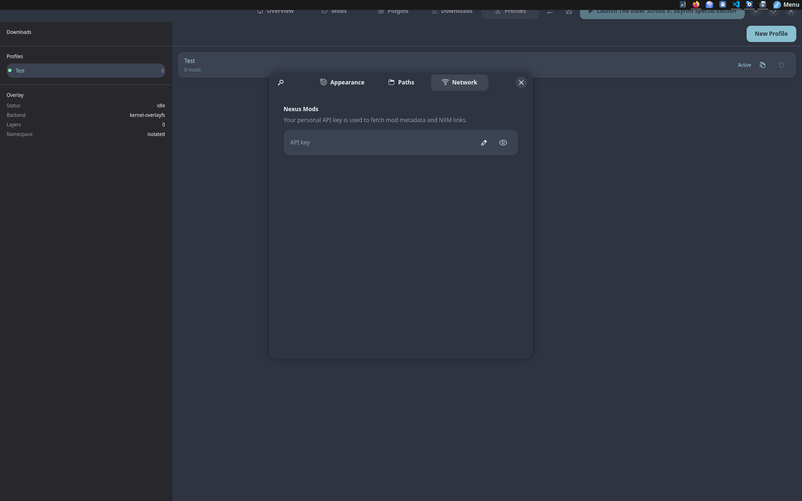

# Mantle Manager

[](https://github.com/mantle-manager/mantle-manager/actions/workflows/ci.yml)
[](LICENSE)
[](flatpak/io.github.mantle_manager.MantleManager.yml)
[](https://www.rust-lang.org)

A ground-up Linux-native mod manager for Bethesda games running through Steam and Proton. Built entirely in Rust with a GTK4/libadwaita UI. No Python layer, no compatibility shim — every component is purpose-built for Linux.

> [!WARNING]
> **Mantle Manager is not in a usable state.** Core systems are still under active development and the application is not ready for actual mod management. It is strongly recommended that you do not attempt to use it on a real game installation at this time.

**Status:** `v0.1.0-alpha` — core mod management, VFS overlay, conflict resolution, BSA extraction, diagnostics, plugin system, download queue persistence, NXM deep-link handling, and game version detection are implemented. UI is functional. See [CHANGELOG.md](CHANGELOG.md) for a full list of additions.

---

## Screenshots

> **Note:** Screenshots were taken early in development and do not reflect the current state of the UI.

| Overview | Mods |
|---|---|
|  |  |

| Plugins | Profiles |
|---|---|
|  |  |

| Downloads | Settings — Paths |
|---|---|
|  |  |

| Settings — Appearance | Settings — Network |
|---|---|
|  |  |

---

## Features

- **VFS overlay** — fuse-overlayfs (all kernels) and kernel overlayfs (6.6+) backends. Mods are layered without touching the game installation.
- **Conflict resolution** — priority-ordered conflict map, loser pruning with backup, and per-file conflict inspection.
- **Archive extraction** — BSA and BA2 archives extracted on mod install via `libarchive` FFI.
- **Case folding** — post-install normalization to lowercase filenames, handling case-only collisions safely.
- **Diagnostics** — cosave checker (SKSE/F4SE/xSE), overwrite classifier (13 categories: DynDOLOD, Nemesis, BodySlide, ENB, etc.).
- **Plugin system** — native Rust plugins (`.so`) and Rhai scripting plugins with an event bus.
- **Steam/Proton integration** — game discovery via `steamlocate`, Proton prefix awareness.
- **Multi-game** — Skyrim LE/SE/VR, Enderal SE, Fallout 4, Fallout NV, Fallout 3, Oblivion, Starfield.
- **Flatpak-first** — designed to run inside the Flatpak sandbox.
- **Theming** — user-installable CSS themes via `~/.local/share/mantle-manager/themes/`. Built-in palettes: Catppuccin Mocha, Catppuccin Latte, Nord, Skyrim, Fallout. Optional `theme.toml` manifests for display name, author, and dark/light hint.
- **Live profile switching** — overview profile-switcher popover activates profiles directly from the main page without navigating away.
- **Mod version tracking** — mod version strings stored in the database and displayed in the mod list and overview.
- **First-run onboarding** — automatically creates a Default profile on first launch so the app is immediately usable.

---

## Building

### Prerequisites

- Rust stable ≥ 1.75 (`rustup toolchain install stable`)
- C libraries: `libarchive`, `fuse3`, `sqlite3`, `pkg-config`
- GTK4 and libadwaita

```bash
# Fedora
sudo dnf install libarchive-devel fuse3-devel sqlite-devel pkgconf gtk4-devel libadwaita-devel

# Ubuntu 24.04+
sudo apt install libarchive-dev libfuse3-dev libsqlite3-dev pkg-config libgtk-4-dev libadwaita-1-dev

# Arch
sudo pacman -S libarchive fuse3 sqlite pkgconf gtk4 libadwaita
```

### Build & Run

```bash
# Development build
cargo build

# Run
cargo run --bin mantle-manager

# Release build
cargo build --release

# Run tests
cargo test --workspace

# Lint (zero warnings enforced)
cargo clippy --workspace -- -D warnings
```

Full build instructions, Flatpak packaging, and CI setup are in [standards/BUILD_GUIDE.md](standards/BUILD_GUIDE.md).

---

## Project Structure

```
mantle-manager/
├── crates/
│   ├── mantle_core/        ← VFS, overlay, conflict, archive, diagnostics, plugins, game detection
│   └── mantle_ui/          ← GTK4/libadwaita application binary
├── standards/              ← All design and coding standards documents
├── doa/                    ← Archived / historical files (never deleted)
├── photos/                 ← UI screenshots
├── mo2_linux_plugins_examples/ ← MO2 plugin reference implementations
├── futures.md              ← Ideas, technical debt, and completed work log
├── conflict.md             ← Architecture conflict register
├── path.md                 ← Feature path / roadmap
└── cleanup.md              ← Deferred cleanup items
```

---

## Documentation

### Standards

All binding standards for this project live in `standards/`. These are the law — see [standards/RULE_OF_LAW.md](standards/RULE_OF_LAW.md) for enforcement rules.

| Document | Description |
|---|---|
| [standards/RULE_OF_LAW.md](standards/RULE_OF_LAW.md) | Governance: how standards are maintained, who can change them, conflict resolution process |
| [standards/ARCHITECTURE.md](standards/ARCHITECTURE.md) | Crate structure, module layout, dependency graph, design philosophy |
| [standards/CODING_STANDARDS.md](standards/CODING_STANDARDS.md) | Rust style, safety rules, error handling, lint policy, `unsafe` requirements |
| [standards/BUILD_GUIDE.md](standards/BUILD_GUIDE.md) | Build prerequisites, system dependencies, Flatpak packaging, CI steps |
| [standards/TESTING_GUIDE.md](standards/TESTING_GUIDE.md) | Test organization, naming conventions, coverage expectations, integration tests |
| [standards/UI_GUIDE.md](standards/UI_GUIDE.md) | GTK4/libadwaita UI patterns, widget conventions, state handling |
| [standards/VFS_DESIGN.md](standards/VFS_DESIGN.md) | VFS overlay architecture, mount lifecycle, namespace isolation, cleanup policy |
| [standards/DATA_MODEL.md](standards/DATA_MODEL.md) | SQLite schema, migration policy, serialization conventions |
| [standards/PLUGIN_API.md](standards/PLUGIN_API.md) | Native plugin ABI, Rhai scripting API, event bus contract |
| [standards/PLATFORM_COMPAT.md](standards/PLATFORM_COMPAT.md) | Linux kernel requirements, SteamOS/Deck specifics, Flatpak sandbox rules |

### Project Governance

| Document | Description |
|---|---|
| [futures.md](futures.md) | Ideas & enhancements, technical debt, known limitations, and completed work log |
| [conflict.md](conflict.md) | Architecture conflict register — open and resolved design disputes |
| [path.md](path.md) | Active feature roadmap and milestone tracking |
| [cleanup.md](cleanup.md) | Deferred code cleanup items |

### Archives

| Document | Description |
|---|---|
| [doa/README.md](doa/README.md) | Index of archived files |
| [doa/2026-03-04_audit.md](doa/2026-03-04_audit.md) | Standards + repository audit log — 2026-03-04 |
| [doa/mantle-manager-ui-concepts.html](doa/mantle-manager-ui-concepts.html) | Early UI concept mockups |

---

## Crate Overview

### `mantle_core`

The heart of the application. All business logic lives here — the UI crate is a thin shell on top.

| Module | Description |
|---|---|
| `vfs/` | Overlay VFS — mount/unmount, fuse-overlayfs and kernel backends, namespace isolation, cleanup |
| `conflict/` | Conflict map building, priority resolution, loser pruning |
| `install/` | Post-install pipeline — BSA/BA2 extraction, case-fold normalization |
| `diag/` | Diagnostics — cosave checker, overwrite classifier |
| `archive/` | BSA, BA2, and generic libarchive extraction |
| `game/` | Game detection (`steamlocate`), game kind registry, Proton prefix discovery |
| `data/` | SQLite persistence, profile management, mod metadata |
| `plugin/` | Native `.so` plugin loader, Rhai scripting engine, event bus |
| `theme/` | User-installable CSS theme discovery — scans `{data_dir}/themes/`, reads `.css` + optional `.toml` manifests |

### `mantle_ui`

GTK4/libadwaita application. Depends only on `mantle_core` and the UI toolkit.

| Module | Description |
|---|---|
| `pages/` | All UI pages (Mods, Plugins, Profiles, Downloads, Settings) |
| `sidebar.rs` | Navigation sidebar |
| `state_worker.rs` | Background worker bridging core async operations to the GTK main loop |
| `window.rs` | Application window, AdwApplicationWindow setup, top-level event routing |

---

## License

GPL-3.0-or-later. See `Cargo.toml`.
